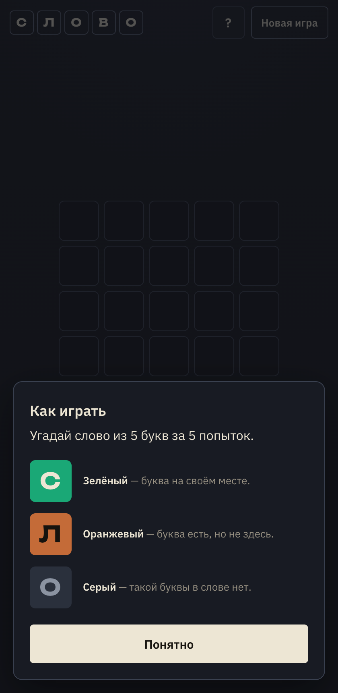
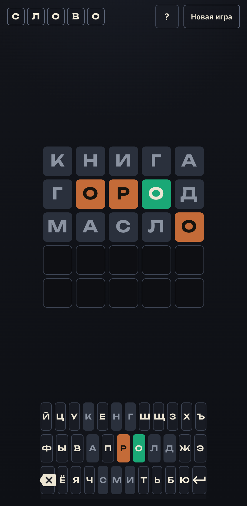

# СЛОВО

Браузерная игра-угадайка: нужно найти загаданное **слово из 5 букв** за **5 попыток**.  
Русская версия механики Wordle / AGENT: кириллица (включая Ё), клавиатура ЙЦУКЕН, локальный словарь.

## Скриншоты

### Онбординг



### Игровой процесс



## Как играть

1. Введи слово из 5 букв и нажми Enter.
2. Цвета подскажут:
   - **зелёный** — буква на своём месте;
   - **оранжевый** — буква есть в слове, но в другой позиции;
   - **серый** — такой буквы в слове нет.
3. Угадай слово за 5 попыток или начни новую игру.

## Стек и технологии

| Слой | Технологии |
|------|------------|
| UI | HTML5, CSS3 (без препроцессоров) |
| Логика | Vanilla JavaScript (ES-модули не нужны — обычные IIFE + `window`) |
| Словарь | Локальный частотный список 5-буквенных слов |
| Шрифты | [IBM Plex Sans](https://fonts.google.com/specimen/IBM+Plex+Sans), [Unbounded](https://fonts.google.com/specimen/Unbounded) |
| Хостинг | GitHub Pages (статика, без сборки) |

Зависимостей и сборщиков нет: открыл `index.html` — игра работает.

### Структура

```
index.html      # разметка и онбординг
css/styles.css  # оформление
js/words.js     # словарь (solutions + допустимые догадки)
js/game.js      # чистая игровая логика без DOM
js/ui.js        # DOM, ввод, анимации
js/main.js      # точка входа
```

## Запуск локально

```bash
open index.html
```

или любой статический сервер из корня репозитория:

```bash
python3 -m http.server 8080
# http://127.0.0.1:8080/
```

## Онлайн

Игра опубликована на GitHub Pages:

**https://askomarov.github.io/wordle-rus/**

## Лицензия

Код можно использовать и менять свободно в рамках этого репозитория.
